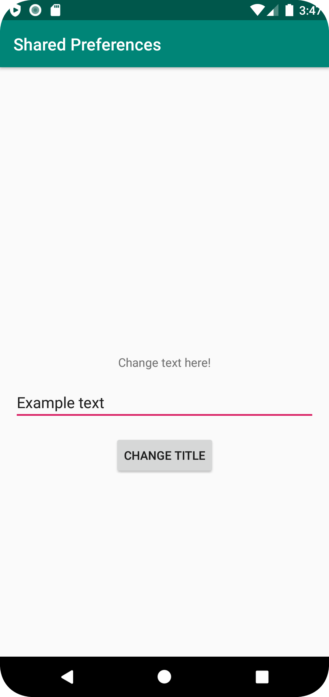

# Rapport
Forked the project and then added all the needed activities for the project.
Then I designed the secondActivity and added what it needed to change the title on the mainActivity.
Added a button in the mainActivity and added onClick to startActivity(intent) on the button press.
The secondActivity got an onClick as well to call the finish() method to close the secondActivity and go back to mainActivity
Then I added the sharedPreference to the secondActivity. I did it because the secondActivity should change the value of the title in mainActivity.
So when the button on secondActivity is clicked it gets the text from the editText and getSharedPreferences from the sharedPreference.
then uses editPrefs to edit the sharedPreference.editor and puts the value from editText and then applies it.

When the button is pressed it did not change the value directly, the program had to restart to be changed.
So instead of having titleEdit.setText and prefs i added it in the onResume() method instead. Now the title edits meanwhile the program is running.
See code snippet.

```Java
//Second Activity
 mainAction.setOnClickListener(new View.OnClickListener() {
            @Override
            public void onClick(View view) {
                value = editText.getText().toString().trim();
                prefs = getSharedPreferences("test", MODE_PRIVATE);
                editPrefs = prefs.edit();
                editPrefs.putString("value", value);
                editPrefs.apply();
                finish();
            }
        });


//Main Activity
protected void onResume() {
        super.onResume();
        prefs = getSharedPreferences("test", MODE_PRIVATE);
        titleEdit.setText(prefs.getString("value", "Change this Text!"));
    }


```



